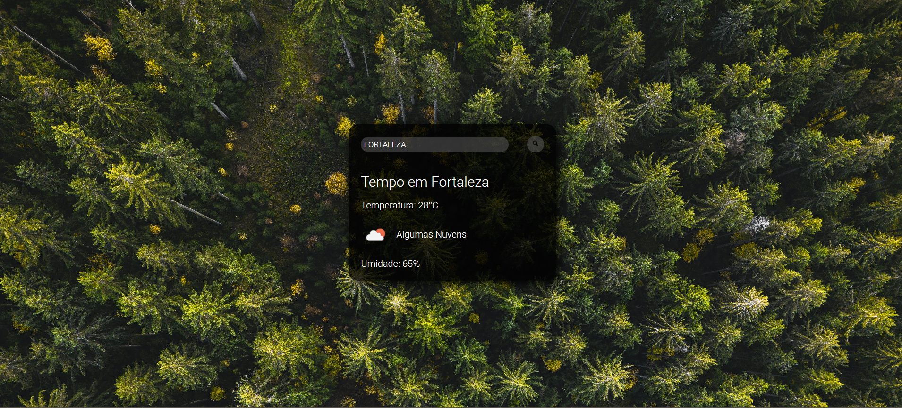

<h1>Previsão do Tempo 🌤️</h1>

Aplicação web que exibe a previsão do tempo em tempo real a partir do nome da cidade informada pelo usuário. O projeto foi desenvolvido com HTML, CSS e JavaScript, consumindo a API pública do OpenWeather.

<h3>Tecnologias utilizadas:</h3>

• HTML5 → Estrutura da aplicação  
• CSS3 → Estilização e responsividade  
• JavaScript (ES6+) → Lógica, manipulação do DOM e integração com API  
• OpenWeather API → Fonte dos dados meteorológicos  

<h3>Funcionalidades:</h3>

Busca de cidade através de campo de input  
Retorno em tempo real com:

• Temperatura (em °C)  
• Condição do tempo (nuvens, chuva, sol, etc.)  
• Umidade do ar  
• Ícone representativo da condição climática    
• Interface responsiva com fundo ilustrativo

<h3>Aprendizados:</h3>

Esse projeto me ajudou a consolidar conhecimentos em:  
• Consumo de APIs REST com fetch, async e await  
• Manipulação dinâmica do DOM com JavaScript  
• Tratamento e exibição de dados externos em interfaces web  
• Boas práticas de UI/UX com foco em clareza e usabilidade  

<h3>Demonstração:</h3>

  

Feito com 💙 por [Débora Iarcheski](https://www.linkedin.com/in/debora-iarcheski/)
